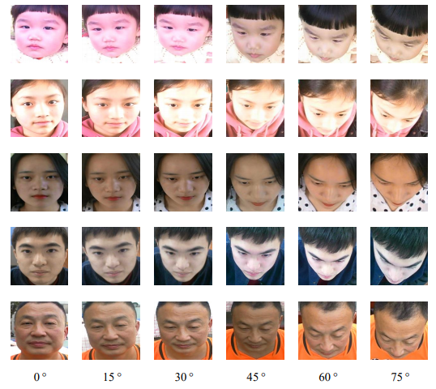
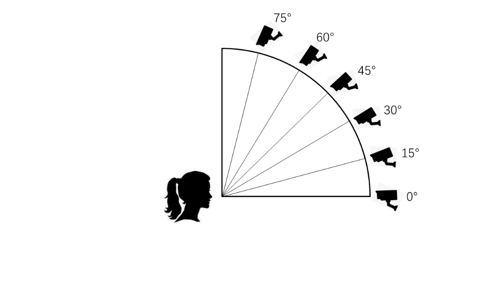

# TFD(A Tilt-angle Face Dataset and Its Application to Face Detection)


<div align=center>
	 
</div>

**TFD**(Tilt-angle Face Dataset) is a  a new  multi-angle face dataset with depression-angle poses shot overhead, containing a total of 5,562 face images from 927 individuals. ALL images were collected in the field and under natural conditions.

We hope that the this dataset can shed lights on the influences of depression-angle face to the face detection task. And improve the face detection models' ability  to detect faces in depression angle. DFD can be applied to training face detection CNN or other purposes, not only for academic research but also for practical applications. 

## **Data Acquisition**

In order to obtain relatively complete top-view angles, we setup a video acquisition equipment composed of six cameras arranged in a curved shape, each corresponding to a vertical angle ranging from 0° to 75°. The layout of our photo collection equipment is shown below.

<div align=center>
	 
</div>

## Data Download

 BaiduDrive Download：https://pan.baidu.com/s/1IayRjNr65sorQnECHBfoVg Extraction Code：3ouw


## Data Statistics

Total number of images: 5,562

Total number of identities: 927

## Notation

We have experimented with datasets on faster R-CNN, YOLOv3, and MTCNN. For ease of experimentation, our annotations are consistent with the Wider Face format.

## Citation

If you find TFD useful in your research, please consider to cite the following paper:

```
@inproceedings{wang2021tilt,
  title={A Tilt-Angle Face Dataset And Its Validation},
  author={Wang, Nanxi and Wang, Zhongyuan and He, Zheng and Huang, Baojin and Zhou, Liguo and Han, Zhen},
  booktitle={2021 IEEE International Conference on Image Processing (ICIP)},
  pages={894--898},
  year={2021},
  organization={IEEE}
}
```

## Contact

huangbaojin@whu.edu.cn
